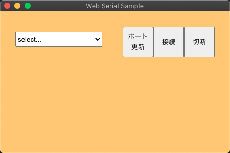
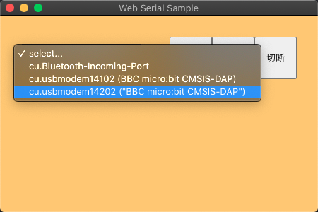
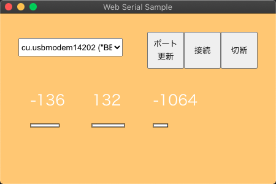
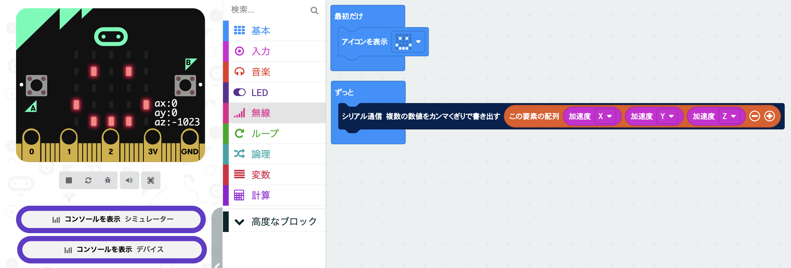

# Electron Fiddle +  WebSerialAPI + p5js

<a href = "https://www.electronjs.org/fiddle">Electron Fiddle</a>をつかって、シリアル通信アプリケーション（試作）をつくりました。Electron v15.0.0以降で動作します。シリアル通信には「WebSerialAPI」をつかっていて、プルダウンメニューでシリアルポートを選べるようにしています。

「WebSerialAPI」は、まだ実験段階ということで、Electronにするとシリアルポート選択のGUIが提供されません。そこでp5jsでプルダウンメニューをつくって、シリアルポートを選べるようにつくりました。

「WebSerialAPI」は、最初にポートをリクエストしないと、ポート情報が得られません。最初に「ポート更新」ボタンをクリックします。

</img>

するとプルダウンに、シリアルポートの一覧が取得できるので、ポートを選択してください。

</img>

「接続」ボタンを押すと、シリアル通信ができます。「切断」で接続が切れます。例は、micro:bitの加速度センサXYZの信号を受信しているところです。

</img>

## micro:bitのテストプログラム

https://makecode.microbit.org/_Uf3KRD5mUTxc

</img>

## 参考

- WebSerialAPIについて参考にさせていただきました

  https://codelabs.developers.google.com/codelabs/web-serial#2
  
  

- ElectronとWebSerialAPIについて参考にさせていただきました

  https://gist.github.com/jkleinsc/284893c7f01d3cb4559508ca06919481#file-main-js-L21

  

- ElectronでWebSerialの「ポート選択のGUIがありません」という情報

	https://github.com/electron/electron/issues/22478#issuecomment-898650533
	
	

- WebSerialAPIとp5js

  https://editor.p5js.org/kuzeshozo/sketches/ahXeFwTB3